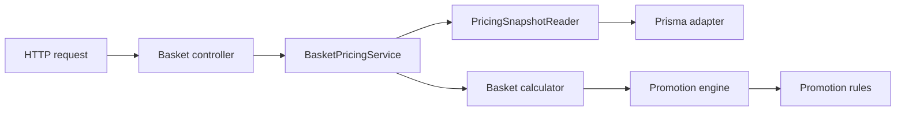

# Basket Pricing API

A small TypeScript HTTP API for calculating supermarket basket prices using stored product data, multi-buy promotions, and optional percentage coupons. Given a shopping basket, the service calculates the correct price by applying eligible promotions and coupons, then returns the **subtotal**, **discounts applied**, **total savings**, and **final amount payable**. The pricing logic is kept separate from the HTTP and persistence layers, making the service straightforward to test and extend with new promotion types.

Built with **TypeScript**, **Fastify**, **Prisma**, and **SQLite**.

## Prerequisites

The required software depends on how you choose to run the application.

### Local development

To run the application directly on your machine, install:

- **[Node.js 24.x](https://nodejs.org/en/download)** - JavaScript runtime used to run and build the application.
- **[npm 11.x](https://docs.npmjs.com/downloading-and-installing-node-js-and-npm)** - Package manager used to install dependencies and run project scripts. npm is normally installed alongside Node.js.
- **A POSIX-compatible shell**, such as:
  - **macOS Terminal** - included with macOS.
  - **Linux shell** - included with most Linux distributions.
  - **[Windows Subsystem for Linux (WSL)](https://learn.microsoft.com/en-us/windows/wsl/install)** - recommended when developing on Windows.

You can verify the installed versions with:

```bash
node --version
npm --version
```

### Docker

If you prefer to run the application using Docker Compose, you only need:

- **[Docker Desktop](https://www.docker.com/products/docker-desktop/)** - recommended for macOS and Windows and includes Docker Compose.
- **[Docker Engine](https://docs.docker.com/engine/install/)** - suitable for Linux environments.
- **[Docker Compose v2.20+](https://docs.docker.com/compose/install/)** - required when it is not already included with your Docker installation.

You can verify the installed versions with:

```bash
docker --version
docker compose version
```

You do **not** need Node.js or npm installed locally when using the Docker Compose startup path.

Dependency versions are locked in package-lock.json to keep installations reproducible.

## Quick start

The quickest way to run the application is with Docker Compose:

```bash
docker compose up --build -d --wait
```

Then open:

- **Swagger UI:** [http://localhost:3000/docs](http://localhost:3000/docs)
- **API:** [http://localhost:3000](http://localhost:3000)

For local TypeScript development, follow the [Start locally](#start-locally) instructions below.

## Running the application

There are two supported ways to start the service:

1. **Local development** - installs dependencies with npm, uses the local `.env` file, and stores the SQLite database under `prisma/dev.db`.
2. **Docker Compose** - builds and runs the application in containers, applies migrations automatically, seeds the sample data, and stores SQLite data in a named Docker volume.

## Start locally

Run the following commands from the repository root.

### 1. Install dependencies

```bash
npm ci
```

### 2. Create the local environment file

```bash
cp .env.example .env
```

### 3. Generate the Prisma Client

```bash
npm run generate
```

### 4. Create the SQLite database file

```bash
touch prisma/dev.db
```

### 5. Apply database migrations

```bash
npm run db:migrate
```

### 6. Seed the sample catalogue and promotions

```bash
npm run db:seed
```

### 7. Start the development server

```bash
npm run dev
```

Once started, the application is available at:

- **API:** [http://localhost:3000](http://localhost:3000)
- **Swagger UI:** [http://localhost:3000/docs](http://localhost:3000/docs)
- **OpenAPI document:** [http://localhost:3000/docs/json](http://localhost:3000/docs/json)

### Run compiled output locally

Build the application:

```bash
npm run build
```

Then start the compiled server using the local `.env` file:

```bash
node --env-file=.env dist/src/server.js
```

`npm start` also runs the compiled application, but expects the required environment variables to already be available in the process environment.

## Start with Docker

Docker Compose provides an alternative setup that does not require Node.js or npm to be installed locally.

### Start the application

```bash
docker compose up --build -d --wait
```

The Compose setup:

- builds the application image;
- applies the committed Prisma migrations;
- seeds the sample catalogue and promotions;
- starts the API on port `3000`;
- stores the SQLite database in a named Docker volume.

Once started, the same endpoints are available:

- **API:** [http://localhost:3000](http://localhost:3000)
- **Swagger UI:** [http://localhost:3000/docs](http://localhost:3000/docs)
- **OpenAPI document:** [http://localhost:3000/docs/json](http://localhost:3000/docs/json)

### Stop the application

Stop the containers while preserving the SQLite data:

```bash
docker compose down
```

### Remove the application and database volume

To stop the containers and intentionally delete the persisted SQLite database:

```bash
docker compose down --volumes
```

## API

Basket pricing is available through:

```http
POST /api/v1/baskets/price
```

The endpoint accepts JSON requests and requires:

```http
Content-Type: application/json
```

### Example request

```bash
curl --fail-with-body http://localhost:3000/api/v1/baskets/price \
  -H 'Content-Type: application/json' \
  -d '{
    "items": [
      { "sku": "COFFEE-001", "quantity": 1 },
      { "sku": "TEA-001", "quantity": 1 },
      { "sku": "BISCUITS-001", "quantity": 1 }
    ],
    "couponCode": "SAVE10"
  }'
```

With the seeded sample data, this basket has a subtotal of `1000p`, total savings of `280p`, and a final price of `720p`.

Interactive **OpenAPI Swagger UI** documentation is available at [`/docs`](http://localhost:3000/docs), and the generated **OpenAPI** document is available at [`/docs/json`](http://localhost:3000/docs/json).

See the [API documentation](docs/api.md) for the complete request and response contract, validation rules, error responses, and health endpoints.

## Pricing rules and assumptions

### Money

All monetary values are represented as integer GBP pence. Floating-point values are not used for prices or totals.

Stored product prices must be non-negative safe integers and may not exceed `1,000,000p` per unit. Prices are treated as final retail prices; tax is not calculated separately.

### Basket normalisation

Requests may contain 1–100 input lines and at most 1,000 units in total. Quantities must be positive integers.

Duplicate product lines are merged before pricing, and normalised lines are ordered by SKU to keep equivalent requests deterministic.

### Buy three, pay for two

The required multi-buy offer works across qualifying units.

Qualifying units are ordered from highest to lowest price and divided into complete groups of three. The cheapest item in each group is free; incomplete groups receive no discount.

All units in a completed group are consumed by that promotion, so a later item-level promotion cannot reuse them. Units outside complete groups remain available to later item-level promotions.

### Promotion ordering and overlap

Item-level promotions run before basket-level promotions.

Within each phase:

1. Lower numeric priority values run first.

2. Promotion code is used as a deterministic tie-breaker.

The engine does not search for the globally optimal combination of overlapping promotions. This keeps results explicit and deterministic.

### Percentage coupon

The API accepts one optional, case-sensitive coupon code.

The seeded `SAVE10` coupon applies 10% to the remaining basket value after item-level promotions, including products that were not eligible for the multi-buy offer.

Percentage savings are calculated once against the applicable basket value and rounded to the nearest penny, with half-pennies rounded upwards.

## Promotion design

Promotion-specific calculations are implemented as rules, while the promotion engine handles generic orchestration, ordering, unit consumption, adjustment validation, and discount accumulation.

The current promotion types are:

```text

BUY_THREE_PAY_TWO

PERCENTAGE_OFF

```

Adding another promotion type typically requires extending the promotion type union, implementing and registering a rule, mapping its stored representation, and adding relevant tests. The core promotion engine does not branch on individual promotion types.

## Configuration

Application configuration is supplied through environment variables. Local development loads them from `.env`, while the container entrypoint additionally supports `SEED_DATABASE`.

| Variable | Default | Description |
| --- | --- | --- |
| `DATABASE_URL` | Required | SQLite connection URL used by Prisma, for example `file:./dev.db` |
| `HOST` | `0.0.0.0` | Network interface on which the HTTP server listens |
| `PORT` | `3000` | HTTP port used by the application; must be between `1` and `65535` |
| `LOG_LEVEL` | `info` | Application log level: `fatal`, `error`, `warn`, `info`, `debug`, `trace`, or `silent` |
| `SEED_DATABASE` | `false` in the container entrypoint | Controls whether sample catalogue and promotion data are seeded during container startup; Docker Compose sets this to `true` |

### Local database

With the included Prisma schema, the following configuration:

```text
DATABASE_URL=file:./dev.db
```

resolves to:

```text
prisma/dev.db
```

This keeps the local development database alongside the Prisma schema and migrations.

### Docker Compose database

Docker Compose configures the application to use:

```text
DATABASE_URL=file:/data/basket.db
```

The `/data` directory is backed by the named SQLite volume, allowing database contents to survive container recreation.

### Example `.env`

```text
DATABASE_URL=file:./dev.db
HOST=0.0.0.0
PORT=3000
LOG_LEVEL=info
```

`SEED_DATABASE` is primarily used by the container startup path and does not normally need to be set for local development when `npm run db:seed` is run explicitly.
## Tests

Use the following commands from the repository root.

**Run all tests:**

```bash
npm test
```

**Run only unit tests:**

```bash
npm run test:unit
```

**Run only integration tests:**

```bash
npm run test:integration
```

**Run the complete project verification:**

```bash
npm run check
```

`npm run check` performs the full local verification workflow, including **ESLint**, **TypeScript type checking**, **unit tests**, **integration tests**, and **application compilation**.
### Unit tests

The unit suite covers core pricing behaviour, including multi-buy grouping, promotion eligibility and ordering, coupon application, rounding, basket normalisation, overlapping promotions, and calculation invariants.

### Integration tests

Integration tests run against a temporary SQLite database with committed migrations and seed data, exercising the Fastify application end to end. They cover core pricing flows, validation and error handling, stored-data failures, health checks, logging, and rate limiting without affecting the development database.

### Container smoke test

With Docker running and port `3000` available:

```bash
sh ci/container-smoke-test.sh
```

The smoke test verifies container startup, basket pricing, and SQLite persistence across container recreation.

## Logging

Structured application logs redact common sensitive HTTP headers, while unexpected failures are logged internally and return a generic client-facing response.

## Persistence

Products, promotions, promotion-product associations, and coupons are stored with Prisma and SQLite.

Pricing requests are read-only, and the pricing snapshot is loaded within a database transaction to provide consistent inputs for each calculation.

## Project structure

```text
src/
  infrastructure/
  modules/pricing/
    adapters/
    controllers/
    domain/rules/
    ports/
    services/
  shared/
prisma/
tests/
docs/
ci/
```

The pricing module separates HTTP handling, data access, orchestration, and pure pricing logic. Domain pricing code does not depend on Fastify or Prisma.



See [Architecture](docs/architecture.md) for the full request flow and component responsibilities.

## Technology choices

| Technology | Purpose |
| --- | --- |
| **TypeScript** | Static typing for domain logic and API contracts |
| **Fastify + TypeBox** | HTTP handling, request validation, response schemas, and OpenAPI generation |
| **Prisma + SQLite** | Typed persistence with a lightweight, self-contained relational database |
| **Node.js test runner** | Lightweight unit and integration testing without an additional test framework |
| **Docker Compose** | Reproducible containerised startup and persistent local SQLite storage |

## Development quality

Dependencies are pinned through `package-lock.json` and maintained with Renovate.

GitHub Actions runs linting, type checking, tests, compilation, dependency auditing, container image scanning, and the container smoke test.

## Trade-offs and limitations

This service is intentionally focused on basket pricing and excludes broader commerce functionality.

### SQLite and deployment

SQLite is appropriate for the self-contained, single-instance deployment used by this service.

### Promotion optimisation

Overlapping promotions are resolved by phase, priority, and promotion code instead of globally optimising the customer discount.

### In-memory rate limiting

Rate-limit counters are stored in process memory and are therefore local to each application instance.

### Application scope

Authentication, inventory, checkout, payments, coupon usage limits, backups, and production deployment are outside the scope of this service.

## AI-assisted development tools
The solution, including all technical decisions, was independently designed, implemented and validated by the author. Github Copilot was used selectively as a development aid during implementation.

## Additional documentation

- [API documentation](docs/api.md) - HTTP contract, validation, errors, and health endpoints.
- [Architecture](docs/architecture.md) - request flow, responsibilities, promotion design, persistence, and operational decisions.
