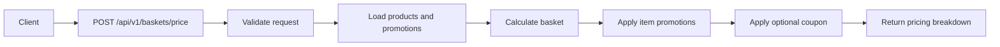
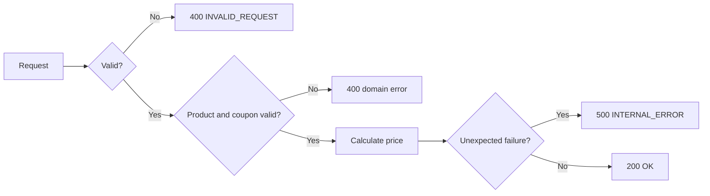

# HTTP API

### Local API access

After starting the application locally, visit the following URLs:

| Resource | URL | Purpose |
| --- | --- | --- |
| **Application** | [http://localhost:3000](http://localhost:3000) | Base URL for the running API service. |
| **Swagger UI** | [http://localhost:3000/docs](http://localhost:3000/docs) | Provides a more detailed and interactive view of the API. You can inspect available endpoints, request and response schemas, validation requirements, example payloads, and **test requests directly against the running service from the browser**. |
| **OpenAPI specification** | [http://localhost:3000/docs/json](http://localhost:3000/docs/json) | Generated OpenAPI document in JSON format for API inspection, automated testing, client generation, and integration with other OpenAPI-compatible tools.

> **Example Swagger UI:** [https://petstore3.swagger.io/](https://petstore3.swagger.io/) - a public example showing what interactive Swagger documentation looks like. This is **not part of this project**. To view and test this project's API, follow the [prerequisites](../README.md#prerequisites) and [quick-start instructions](../README.md#quick-start), then open [http://localhost:3000/docs](http://localhost:3000/docs).
> 
## Endpoints

| Method | Endpoint | Purpose |
| --- | --- | --- |
| `POST` | `/api/v1/baskets/price` | Calculate a basket price |
| `GET` | `/health/live` | Liveness check |
| `GET` | `/health/ready` | Readiness check |

## Request flow



## Calculate a basket price

```http
POST /api/v1/baskets/price
```

Requires:

```http
Content-Type: application/json
```

### Request

```json
{
  "items": [
    { "sku": "COFFEE-001", "quantity": 1 },
    { "sku": "TEA-001", "quantity": 1 },
    { "sku": "BISCUITS-001", "quantity": 1 }
  ],
  "couponCode": "SAVE10"
}
```

### Request fields

| Field | Rules |
| --- | --- |
| `items` | Required array containing 1–100 lines |
| `items[].sku` | Required string of 1–64 uppercase letters, digits, underscores, or hyphens; must identify an active product |
| `items[].quantity` | Required positive integer; at most 1,000 units across the complete basket |
| `couponCode` | Optional string of 1–32 uppercase letters, digits, underscores, or hyphens; must identify an active coupon linked to an active promotion |

Additional request properties are rejected. Numeric strings are not accepted as quantities. Duplicate SKU lines are merged before pricing.

Prices and promotion eligibility are loaded from the database. Persisted records use generated UUID primary keys internally; the API uses product SKUs, promotion codes, and coupon codes as stable business identifiers.

### Successful response

Returns `200 OK`.

With the seeded sample data:

```json
{
  "currency": "GBP",
  "items": [
    {
      "sku": "BISCUITS-001",
      "name": "Biscuits",
      "quantity": 1,
      "unitPricePence": 200,
      "lineSubtotalPence": 200
    },
    {
      "sku": "COFFEE-001",
      "name": "Coffee",
      "quantity": 1,
      "unitPricePence": 500,
      "lineSubtotalPence": 500
    },
    {
      "sku": "TEA-001",
      "name": "Tea",
      "quantity": 1,
      "unitPricePence": 300,
      "lineSubtotalPence": 300
    }
  ],
  "subtotalPence": 1000,
  "discounts": [
    {
      "promotionCode": "THREE_FOR_TWO",
      "description": "Buy three qualifying items, pay for two",
      "savingPence": 200,
      "freeItems": [
        { "sku": "BISCUITS-001", "quantity": 1 }
      ]
    },
    {
      "promotionCode": "TEN_PERCENT_OFF",
      "description": "10% off the remaining basket",
      "savingPence": 80,
      "freeItems": [],
      "couponCode": "SAVE10",
      "basisPence": 800
    }
  ],
  "totalSavingsPence": 280,
  "totalPence": 720
}
```

All monetary values are integer GBP pence.

| Field | Meaning |
| --- | --- |
| `items` | Merged basket lines ordered by SKU |
| `items[].sku` | Stable business identifier for the product |
| `lineSubtotalPence` | Line value before discounts |
| `subtotalPence` | Sum of the original line values |
| `discounts` | Applied savings in application order |
| `discounts[].promotionCode` | Stable business identifier for the applied promotion |
| `freeItems` | Units made free by an item-level promotion |
| `couponCode` | Coupon code responsible for a coupon-based discount |
| `basisPence` | Basket value used to calculate the percentage coupon |
| `totalSavingsPence` | Sum of all individual savings |
| `totalPence` | `subtotalPence - totalSavingsPence` |

When no discounts apply, `discounts` is empty and `totalSavingsPence` is `0`.

Item-level promotions apply before the optional coupon. Grouping, overlap, and rounding behaviour are documented in the main [README](../README.md).

Pricing requests are read-only: they do not create orders, reserve stock, or redeem coupons.

## Errors

Errors contain a code, message, and request ID. Some errors also include structured details.

Clients should rely on error codes and structured details rather than exact message wording.

### Error handling flow



### Error codes

| HTTP status | Error code | Meaning |
| --- | --- | --- |
| `400` | `INVALID_REQUEST` | Malformed JSON, invalid request structure, or invalid basket quantities or limits |
| `400` | `UNKNOWN_PRODUCT` | Requested product SKU is unknown or inactive |
| `400` | `INVALID_COUPON` | Coupon is unknown, inactive, or linked to an inactive promotion |
| `404` | `NOT_FOUND` | No matching route |
| `413` | `PAYLOAD_TOO_LARGE` | Request body exceeds the configured HTTP body limit |
| `415` | `UNSUPPORTED_MEDIA_TYPE` | Request content type is unsupported |
| `429` | `RATE_LIMIT_EXCEEDED` | Pricing request rate limit exceeded |
| `500` | `INTERNAL_ERROR` | Unexpected failure or invalid stored configuration |
| `503` | `NOT_READY` | Readiness check cannot access the database |

### Request validation

For a basket line with `quantity: 0`, the API returns `400 Bad Request`:

```json
{
  "error": {
    "code": "INVALID_REQUEST",
    "message": "Request validation failed.",
    "requestId": "req-1",
    "details": [
      {
        "path": "/items/0/quantity",
        "message": "must be >= 1"
      }
    ]
  }
}
```

Validation paths use JSON Pointer notation:

| Path | Meaning |
| --- | --- |
| `/items/0/quantity` | The first basket line's quantity |
| `/items` | The `items` field, including when it is missing |
| Empty path | The request body itself |

Validation details describe reported failures and are not guaranteed to list every invalid field. Malformed JSON and application-level basket errors may omit field details.

### Unknown or inactive products

For an unknown product SKU, the API returns `400 Bad Request`:

```json
{
  "error": {
    "code": "UNKNOWN_PRODUCT",
    "message": "One or more products are unknown or inactive.",
    "requestId": "req-2",
    "details": {
      "skus": ["MISSING-001"]
    }
  }
}
```

Request IDs vary per request and can be used to correlate responses with server logs.

Unexpected failures return a generic client-facing response without internal exception details. Diagnostic information is logged by the server.

### Rate limiting

The basket-pricing endpoint allows up to **500 requests per IP address per minute**.

Requests above the limit return `429 Too Many Requests` with error code `RATE_LIMIT_EXCEEDED` and a `Retry-After` header.

Health endpoints are not subject to the pricing endpoint rate limit.

## Health endpoints

### Liveness

```http
GET /health/live
```

Returns `200 OK` when the HTTP application is responding:

```json
{
  "status": "ok"
}
```

### Readiness

```http
GET /health/ready
```

Returns `200 OK` when the product table is accessible:

```json
{
  "status": "ready"
}
```

If the database check fails, the endpoint returns `503 Service Unavailable` with error code `NOT_READY`.

Readiness verifies database access. It does not validate catalogue completeness or every stored promotion setting.
