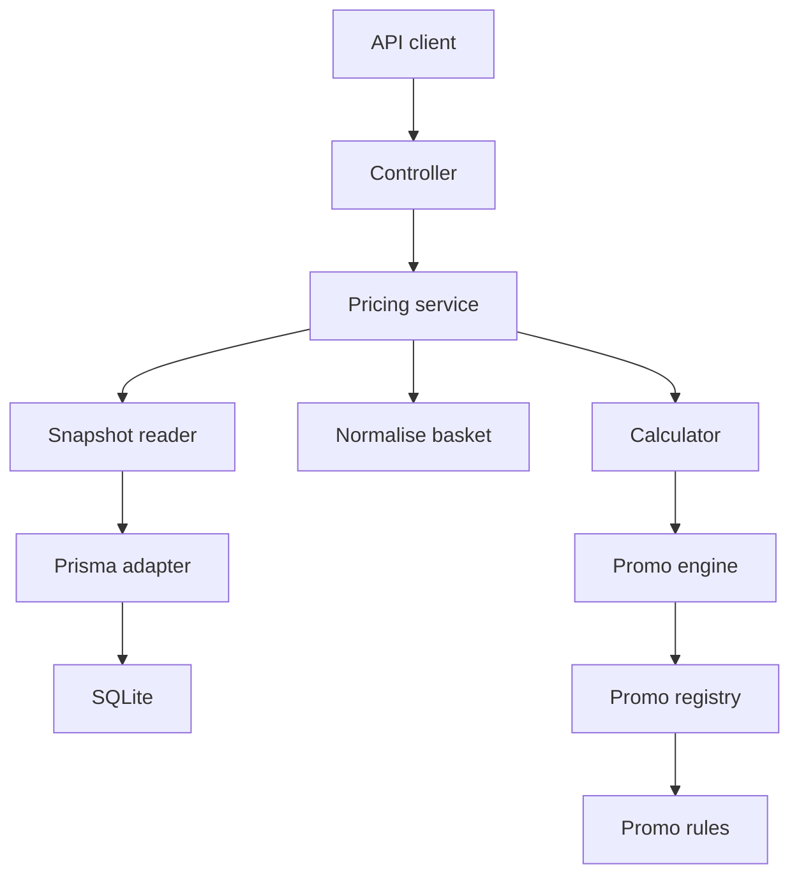
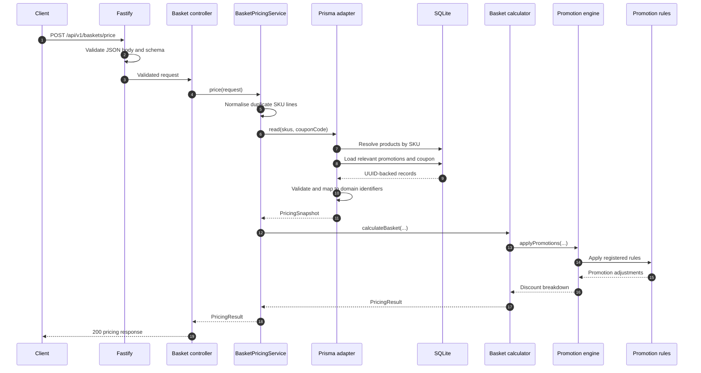
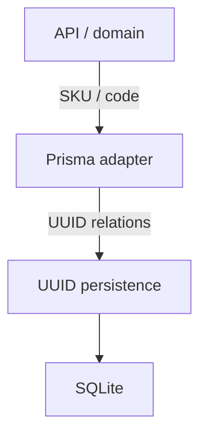
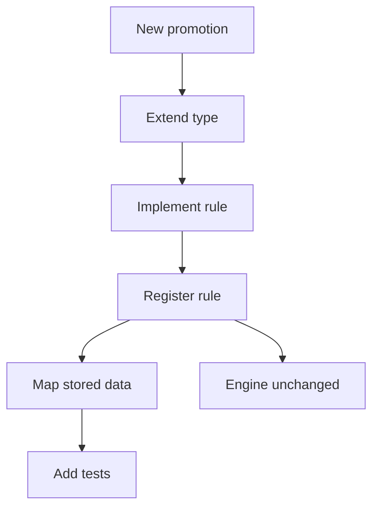
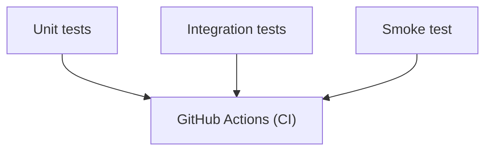

# Basket pricing architecture

## Overview

The service calculates the price of a supermarket basket from **product SKUs and quantities**, with an optional **coupon code**. Product prices and promotion rules are stored by the application. For each request, the service resolves the relevant products and promotions, calculates the subtotal, applies eligible discounts such as **buy three, pay for two** and percentage coupons, then returns the **subtotal**, **applied discounts**, **total savings**, and **final amount payable**. The implementation is a single deployable TypeScript API built with **Fastify**, **Prisma**, and **SQLite**. The pricing domain is independent of Fastify and Prisma, keeping the core calculation logic easy to test and separate from infrastructure concerns.

The architecture separates:

- **HTTP handling** - request validation and responses.
- **Application orchestration** - coordinates the pricing workflow.
- **Persistence** - loads products, promotions, and coupons.
- **Pricing domain** - applies rules and calculates totals.

The pricing domain is independent of Fastify and Prisma, keeping the core calculation logic easy to test and separate from infrastructure concerns.

## Component architecture

The service is organised around explicit HTTP, application, domain, and persistence boundaries.

### Responsibilities

| Component | Responsibility |
| --- | --- |
| Request and response schemas | Define the HTTP contract and validate request structure |
| Basket controller | Connect the HTTP endpoint to the pricing service |
| Pricing service | Coordinate normalisation, snapshot retrieval, and calculation |
| Pricing snapshot port | Define the data required by pricing without exposing Prisma |
| Prisma adapter | Resolve business identifiers, retrieve UUID-backed records, validate stored settings, and map them to domain types |
| Basket calculator | Build priced lines and units, calculate the subtotal, and assemble the result |
| Promotion engine | Order promotions, track consumed units, validate generic adjustments, and accumulate discounts |
| Promotion registry | Map supported promotion types to their rules |
| Promotion rules | Calculate promotion-specific adjustments and response metadata |
| Money helpers | Validate integer amounts and calculate rounded percentage savings |

Domain calculations do not import Fastify or Prisma.

`src/app.ts` assembles routes and dependencies. `src/server.ts` owns startup, signal handling, and shutdown. Prisma client construction belongs to `src/infrastructure/database/`.

## Request sequence

A pricing request crosses the HTTP, application, persistence, and domain boundaries in this order.

The database reads occur inside one Prisma transaction so each calculation receives a consistent pricing snapshot.

## Data model

- `Product` uses a generated UUID primary key and a unique SKU used as its business identifier.
- `Promotion` uses a generated UUID primary key and a unique promotion code used as its business identifier.
- `Coupon` uses a generated UUID primary key and a unique coupon code.
- `PromotionProduct` associates products with qualifying item offers using UUID foreign keys and a composite key of `promotionId` and `productId`.

SQLite persists catalogue and promotion data. Pricing requests do not persist baskets or calculated results.

The Prisma adapter forms the boundary between these two representations:

The adapter rejects unknown or inactive requested products and coupons. Unsupported promotion types and invalid stored settings fail as internal errors rather than being silently ignored.

## Pricing behaviour

### Basket normalisation and money

i. Currency is GBP, represented as integer pence.  
ii. Quantities must be positive integers.  
iii. Requests accept 1–100 input lines and at most 1,000 total units.  
iv. Duplicate product lines are merged and ordered by SKU.  
v. Stored prices must be non-negative safe integers no greater than `1,000,000p` per unit.  
vi. Money helpers validate totals and percentage-calculation intermediates.  
vii. Stored product prices are treated as final retail prices inclusive of any applicable tax; tax is not calculated or itemised separately by this service.

### Buy three, pay for two

Eligible units are sorted by descending price, with the basket-unit ID used as a deterministic tie-breaker. Each complete group of three receives its cheapest unit free. All three units in a completed group are then marked as consumed, preventing later item-level promotions from reusing either the paid or free units, while units outside complete groups remain eligible for subsequent promotions. Repeated units of the same product may form a qualifying group. Basket-unit IDs exist only for the duration of a pricing calculation and are not persisted database identifiers.

### Promotion ordering and overlap

Item-level promotions are applied before basket-level promotions. Within each phase, lower-priority numbers run first, with the promotion code used only as a deterministic tie-breaker when priorities are equal.
This keeps promotion application predictable and repeatable. The engine does not attempt to find the combination of overlapping offers that would maximise the total customer saving.

### Percentage coupon

The API accepts one optional, case-sensitive coupon code. The percentage discount is applied to the remaining basket value after item-level promotions, including products that were not eligible for the multi-buy offer. The saving is calculated once and rounded to the nearest penny, with half-pennies rounded up; for example, 10% of 465p produces a 47p saving.

### Adjustment validation

Promotion rules calculate promotion-specific adjustments, while the promotion engine validates a set of generic invariants before applying them:

i. Savings must be non-negative safe integers and must not exceed the remaining basket value.
ii. Consumed unit identifiers must be unique, known, and not already consumed.
iii. Free unit identifiers must be unique and belong to the consumed group.
iv. When free units are reported, their prices must add up to the reported saving.
v. Basket-level promotions must not consume individual units.

Promotion-specific response metadata, such as free-item details or the coupon calculation basis, is supplied by the rule that produced the adjustment. Only positive savings appear in the discount breakdown.

## Adding a promotion type

A new promotion typically requires:

1. Extending the promotion type union.
2. Implementing a rule and registering it.
3. Adding stored-data mapping and validation in the adapter.
4. Adding calculation and overlap tests.
5. Updating persistence or API schemas if the new mechanism requires additional stored or response fields.

Promotion rules own their promotion-specific calculation and discount breakdown metadata. The promotion engine remains responsible for generic orchestration, ordering, unit-consumption tracking, and adjustment validation, and does not branch on individual promotion types.

### Errors and lifecycle

HTTP schemas reject malformed basket structures, while application errors identify invalid product SKUs, coupons, and basket limits.

The shared error handler returns consistent error responses with request IDs. Unexpected failures are logged internally and return a generic client-facing message.

Startup validates configuration and checks database access before the server begins listening. `SIGINT` and `SIGTERM` trigger graceful shutdown with a 10-second deadline.

i. `/health/live` confirms that the API process is responding.  
ii. `/health/ready` confirms that the application can access the product table.

The readiness check verifies database accessibility

## Verification and Testing

**Unit tests:** cover the calculator, including grouping, repeated products, eligibility, coupon ordering, rounding, normalisation, overlapping offers, and deterministic promotion-code ordering.

**Integration tests:** apply migrations and seed a temporary SQLite database, then validate the HTTP handlers using Fastify injection. They also verify that the API uses SKUs and promotion codes while UUIDs remain internal to persistence.

**Container smoke test:** checks startup, pricing, and persistence of a non-seeded product across container recreation.

**Continuous integration:** GitHub Actions provides the continuous integration pipeline for the project. On each push and pull request, it installs dependencies, generates the Prisma Client, runs linting and TypeScript type checks, executes the unit and integration test suites, builds the application, performs security checks, and runs the container smoke test to verify that the packaged service starts correctly and works with persisted data.

## Scope and limitations

The service calculates a basket price.

Authentication, creating orders, reserving stock, processing payments, and production deployment are outside the scope of this service.
